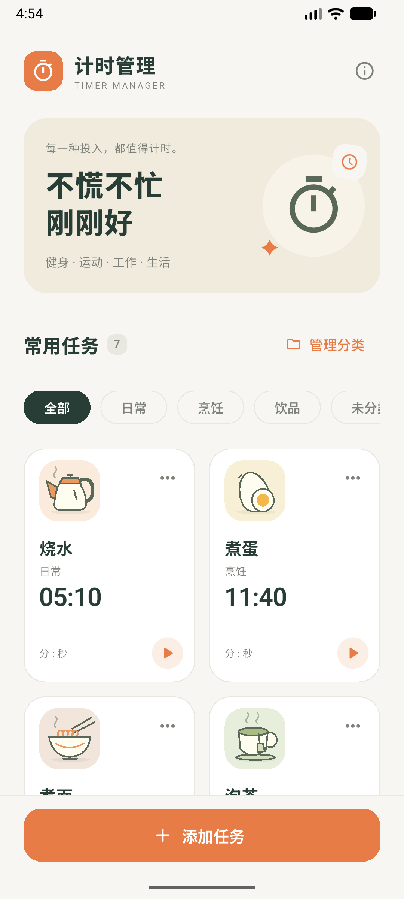

# 计时管理 · Timer Manager

一个中文 Flutter 通用计时管理应用，适用于健身、运动、工作、学习、烹饪和日常生活。轻点任务卡片即可开始倒计时，任务与分类都可以自由管理。

## 功能

- **自定义任务**：添加、编辑、删除任务；自由设置名称、图标和时长，支持 1 秒至 99 小时 59 分 59 秒。删除任务后可撤销。
- **自定义分类**：新建、重命名、删除分类；为任意任务选择所属分类，图标与分类互不绑定。删除分类后，任务移到「未分类」。
- **快速整理**：首页按分类筛选，卡片显示所属分类；在某个分类下添加任务时自动选中该分类，也可以在任务表单内直接新建分类。
- **多任务计时**：多个任务同时运行，支持暂停、继续、重置、取消和完成后再来一次。同一任务不会重复启动；重置恢复原时长并暂停。
- **数据持久化**：任务、分类及计时状态自动保存在本地。重新打开应用会恢复剩余时间或显示已完成；编辑任务或分类不影响正在进行的计时。
- **Android 提醒**：到时通知、声音和振动，支持后台、锁屏、进程退出及设备重启后的提醒恢复。
- **通用视觉**：提供通用、健身、运动、工作、学习、冥想及烹饪图标，保留暖色卡片和本地矢量插画，适配窄屏与放大字体。

首次安装提供 9 个示例任务（包括烧水、煮蛋、专注工作、平板支撑、跑步训练）和 6 个可编辑分类。它们仅是起点，用户可继续添加自己的任务和分类。

## 使用

1. 点击底部「添加任务」，输入名称、时长，选择分类与图标，保存后轻点卡片开始计时。
2. 点击卡片右上角「⋯」→「编辑」，可以修改任务，也可以将它移到其他分类或「未分类」。
3. 点击「管理分类」新建、重命名或删除分类；任务表单的「新建分类」入口会在创建后自动选中新分类。
4. 第一次开始计时时允许通知；若提醒权限未开启，可通过活动计时区的提示进入系统设置。

分类和任务名称最多 20 个字符。分类名称不能重复，「全部」「未分类」为保留名称。

## 运行与构建

当前配置 **Android**，最低 Android 7.0（API 24）。已验证 Flutter **3.47.2** / Dart **3.13.2**，需要可用的 Android SDK 和 JDK。Gradle 工具链配置见 `android/gradle/gradle-daemon-jvm.properties`。

```sh
git clone https://github.com/Ghpt6/timer-manager.git
cd timer-manager
flutter pub get
flutter run
```

本机 Flutter SDK 位于 `D:/Dev/flutter`。未配置 PATH 时可在 PowerShell 中使用 `& D:/Dev/flutter/bin/flutter.bat run`。

```sh
dart format lib test
flutter analyze
flutter test
flutter build apk --debug
```

调试包：`build/app/outputs/flutter-apk/app-debug.apk`。较小的分架构体验包：

```sh
flutter build apk --release --split-per-abi
```

通常 Android 真机使用 `build/app/outputs/flutter-apk/app-arm64-v8a-release.apk`。当前 release 配置沿用调试签名，商店发布前需配置正式签名。

版本为 **1.1.0+4003**，可以保留原应用数据覆盖安装。调试和分架构包共用 `pubspec.yaml` 的构建号，已关闭 ABI 版本号偏移；后续更新递增 `+` 后的构建号。

修改 Android 原生代码后，在 `android` 目录运行 `./gradlew :app:lintDebug`（Windows 用 `./gradlew.bat`）。首次克隆先执行 Flutter 构建以生成 wrapper 和 local.properties；直接调用 Gradle 前需配置 `JAVA_HOME`。

## 代码导航

| 文件 | 职责 |
| --- | --- |
| `lib/main.dart` | 应用入口、主题与 controller 生命周期 |
| `lib/src/timer_models.dart` | 任务、分类、图标和活动计时模型 |
| `lib/src/timer_controller.dart` | 状态变更、计时、持久化与数据迁移 |
| `lib/src/home_page.dart` | 首页、分类筛选、活动计时与任务卡片 |
| `lib/src/preset_editor.dart` | 任务表单、选择分类及图标 |
| `lib/src/category_manager.dart` | 分类创建、重命名和删除 |
| `lib/src/task_art.dart` | 本地矢量插画与通用图标 |
| `lib/src/timer_platform.dart` | Flutter / Android MethodChannel |
| `android/app/src/main/kotlin/com/example/flutterproject/TimerAlarms.kt` | 本地存储、系统闹钟、通知与重启恢复 |
| `AGENTS.md` | 面向后续开发者与 AI 编程助手的项目约束和验证指南 |

测试覆盖计时精度与恢复、任务快照隔离、自定义分类持久化、分类删除与换分类、旧数据迁移、表单校验及 320px 窄屏和放大字体。

## 升级与平台说明

本地数据格式已从 version 1 升至 version 2，新增独立的分类记录和任务 `categoryId`。旧版用户原有任务、名称、时长、分类归属和正在运行的计时会保留；升级时不会额外插入示例任务，已清空的任务库也保持为空。删除分类不改变活动计时的快照或结束时间。

Android applicationId、MethodChannel 和存储标识沿用旧值，以支持覆盖安装和读取旧数据。倒计时依据绝对结束时间计算；Android 用 `AlarmManager.setAlarmClock` 安排精确提醒，并按每次运行的结束时间去重。未获精确提醒权限时会降级并提示用户。通知未开启时无法发送后台通知；系统「强行停止」会取消闹钟，重新打开后恢复安排。手动修改系统时间会影响剩余时间。

当前没有 iOS 工程或对应的平台提醒实现。
